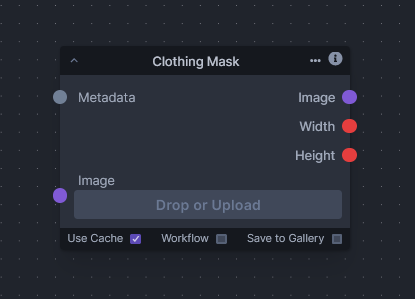

# Clothing Mask

The "Clothing Mask" node leverages the capabilities of U2NET, a deep neural network architecture known for its powerful performance in image segmentation tasks. This node is fine-tuned specifically for the segmentation of clothing items within images.

U2NET stands out with its architecture that combines a deep network with the ability to capture rich contextual information and multiple levels of features, which is particularly beneficial for complex segmentation tasks like identifying clothing with varying textures, shapes, and sizes against diverse backgrounds.
